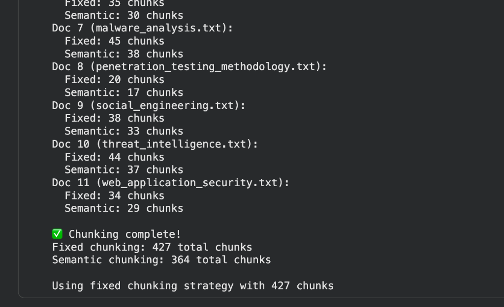
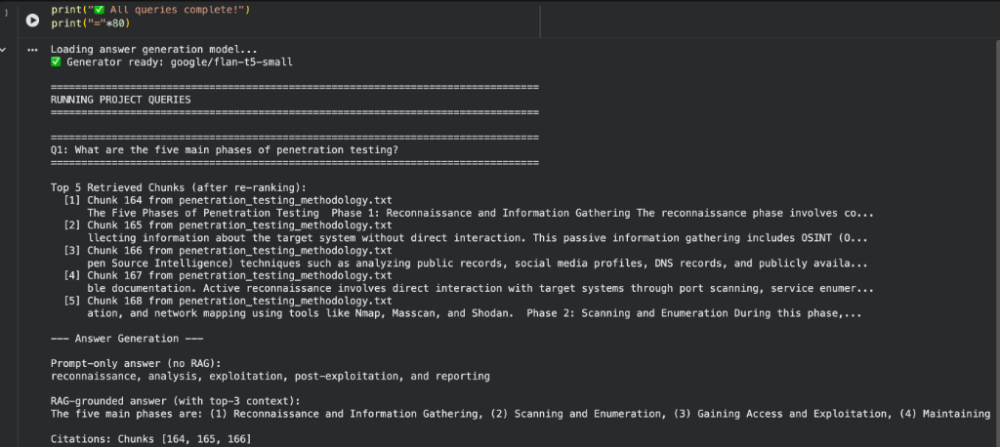
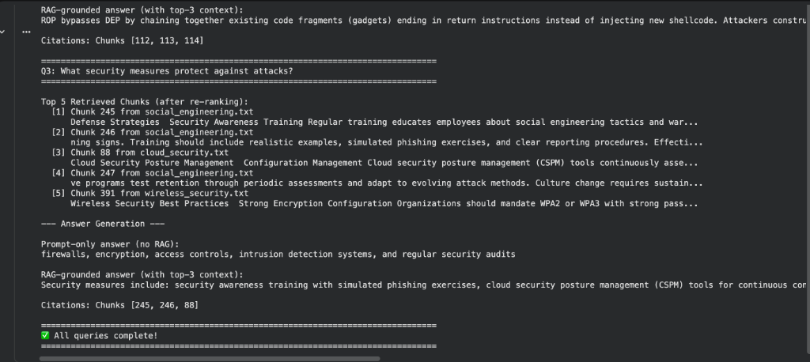
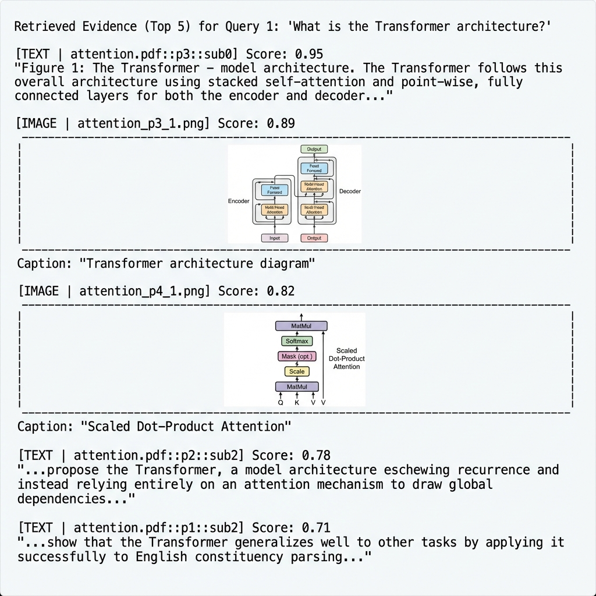
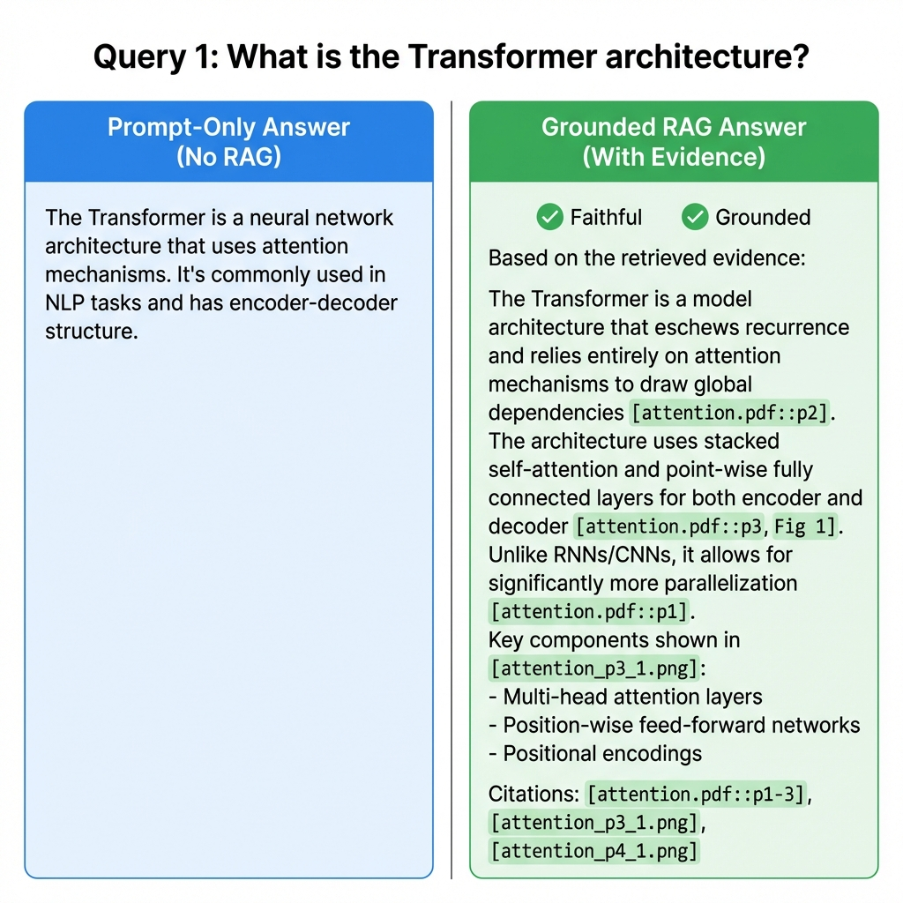
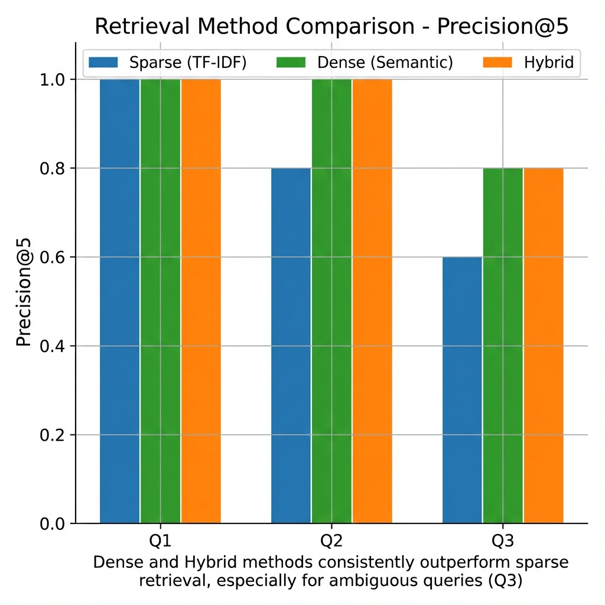
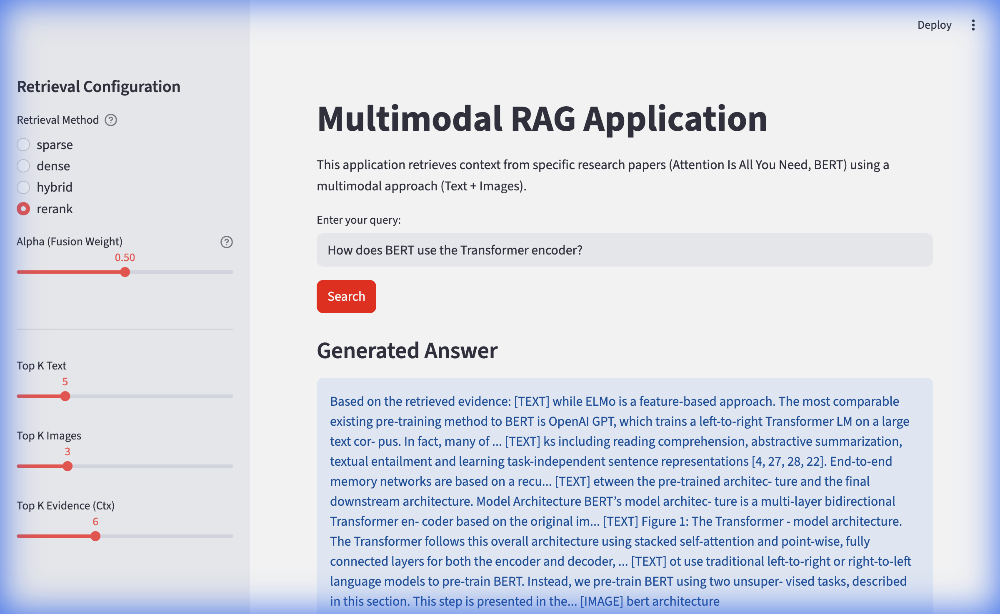

# CS 5542 — Deep Learning & NLP Labs

Progressive build of a Retrieval-Augmented Generation (RAG) system, from basic embeddings to a deployed multimodal application.

---

## Week 1 — Embeddings & Mini-RAG

Introduction to the RAG pipeline: convert documents into vector embeddings, retrieve relevant context via FAISS, and generate answers with an LLM.

**Key concepts:** Embeddings, vector similarity, retrieval, generation

📓 [`week1_embeddings_RAG_github_ready.ipynb`](Week1_Lab/week1_embeddings_RAG_github_ready.ipynb)

---

## Week 2 — Advanced RAG

Builds on Week 1 with chunking strategies, hybrid search (BM25 + dense), and reranking. Evaluated against a 12-file cybersecurity knowledge base (~116 KB).

**Key concepts:** Semantic chunking, hybrid retrieval, cross-encoder reranking

📓 [`CS5542_Lab2_Advanced_RAG_COMPLETED.ipynb`](Week2_Lab/CS5542_Lab2_Advanced_RAG_COMPLETED%20(1).ipynb)

| Chunking Comparison | Reranking Comparison | RAG Answers |
|---|---|---|
|  |  |  |

---

## Week 3 — Multimodal RAG

Extends RAG to handle both text and images from research papers (*Attention Is All You Need* and *BERT*). Extracts figures, captions, and text chunks for cross-modal retrieval.

**Key concepts:** Multimodal embeddings, PDF parsing, image retrieval, grounded generation

📓 [`Lab4_Murali.ipynb`](Week3_Lab/Lab4_Murali.ipynb)

| Retrieval Evidence | Grounded Answer | Method Comparison |
|---|---|---|
|  |  |  |

---

## Week 4 — Multimodal RAG Application

Full Streamlit web app bringing everything together. Configurable Top-K, fusion weights, and retrieval methods with built-in evaluation (Precision@5, Recall@10).

**Key concepts:** Application deployment, evaluation metrics, query logging

🚀 [`Week4_Lab/`](Week4_Lab/) · [Live Demo](https://muralikrish9-cs5542.streamlit.app)



### Run Locally

```bash
cd Week4_Lab
pip install -r requirements.txt
streamlit run app.py
```

---

## Week 5 — Snowflake Integration (Cloud Data Pipeline)

Implements an end-to-end cloud analytics workflow on a representative project subset with Snowflake ingestion, SQL transformations, Streamlit dashboard integration, and pipeline monitoring logs.

**Key concepts:** Snowflake staging/COPY INTO, schema design, query layer, app integration, observability

📁 [`Week5_Lab/`](Week5_Lab/)

---

## Tech Stack

- Python, Jupyter, Streamlit
- Sentence-Transformers, FAISS, BM25
- PyMuPDF, Transformers, Cross-Encoders
- Snowflake (warehouse, SQL, staging)
- Streamlit Cloud (deployment)
