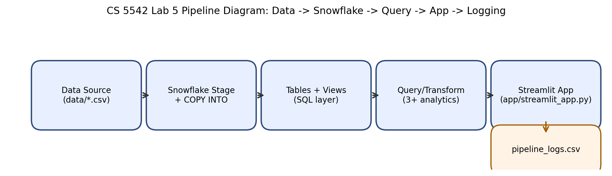

# CS 5542 — Week 5: Snowflake Integration (Lab 5)

This folder implements a reproducible **Data → Snowflake → Query/Transform → Streamlit App → Logging** pipeline for Lab 5.

## Team + Project
- **Team:** Team Promptocalypse
- **Project:** AI Security Analytics Pipeline (Snowflake integration sprint)

## Week 5 Scope (~50% subset)

| Item | Included this week | Deferred |
|---|---|---|
| Datasets | `events.csv`, `users.csv` (representative analytics subset) | Full historical logs + additional project feeds |
| Features | ingestion scripts, Snowflake schema, 3+ analytics queries, Streamlit query UI, pipeline logging | Extended automation jobs + advanced optimization |

## Repository Contents (Lab 5 requirements)
- ingestion scripts → `scripts/`
- SQL schemas + queries → `sql/`
- transformation / analytics queries → `sql/03_queries.sql`
- dashboard / application code → `app/streamlit_app.py`
- pipeline diagram (PNG) → `pipeline_diagram.png`
- demo video link → add under **Demo Video** below
- system workflow + extensions documented → this README
- member responsibilities documented → `CONTRIBUTIONS.md`
- pipeline log CSV → `logs/pipeline_logs.csv`

## Pipeline Diagram


## End-to-End Flow
1. Source CSV data in `data/`
2. Snowflake staging + `COPY INTO` loading
3. Table/query layer in `sql/`
4. Interactive query execution in Streamlit
5. Runtime metrics logged in `logs/pipeline_logs.csv`

## Setup
1. Create `.env` from `.env.example` and set Snowflake credentials.
2. Install dependencies:
   ```bash
   pip install -r requirements.txt
   ```

## Snowflake SQL Setup (run in order)
1. `sql/01_create_schema.sql`
2. `sql/02_stage_and_load.sql`

## Data Ingestion
```bash
python scripts/load_local_csv_to_stage.py data/events.csv EVENTS
python scripts/load_local_csv_to_stage.py data/users.csv USERS
```

## Query / Transformation Layer
Implemented queries in `sql/03_queries.sql`:
1. Aggregation/group-by analytics
2. Time-filtered category trends (last 24h)
3. Multi-table join analysis (`USERS` x `EVENTS`)

## Application / Dashboard Integration
Run the app:
```bash
streamlit run app/streamlit_app.py
```
The dashboard supports:
- parameterized category filtering
- query selection and execution
- table + chart output
- latency + row-count logging

## Monitoring & Pipeline Logging
`logs/pipeline_logs.csv` captures:
- timestamp
- team
- user
- query used
- latency (ms)
- returned row count
- error (if any)

### Observed behavior / bottlenecks
- Cold-start query latency is typically higher than warm runs.
- Join-heavy queries scale with table size and benefit from better clustering/materialized views in later phases.
- App logging adds negligible overhead relative to warehouse query time.

## Team-Scaled Extensions Completed
1. **Enhanced monitoring fields** (`team`, `user`, `error`) in pipeline logs.
2. **Interactive dashboard controls** (parameterized filter + dynamic limits).
3. **Derived analytics path** via join query for role/category behavior.

## Demo Video
- Pending upload (add unlisted YouTube/Drive link before Canvas submission).

## Individual contribution document (Canvas)
A draft 1-page individual README is available at:
- `../academic/cs5542-lab5-individual-contribution-draft.md`
