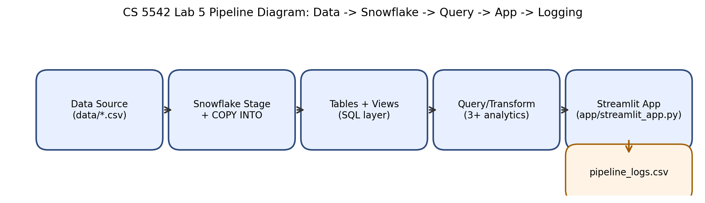

# CS 5542 — Week 5: Snowflake Integration (Lab 5)

This folder implements a reproducible **Data → Snowflake → Query/Transform → Streamlit App → Logging** pipeline for Lab 5, using real data from our semester project: **Multi-Agent AI Attack Swarm Detection**.

## Team + Project
- **Team:** Team Promptocalypse (Solo submission — Murali Ediga)
- **Project:** Multi-Agent AI Attack Swarm Detection via Behavioral Fingerprinting

## Dataset (~50% Project Subset)

| Dataset | Records | Description |
|---|---|---|
| `sessions.csv` | 1,619 | Honeypot sessions: AI swarm (1,347), human pentesters (49), scripted bots (223) |
| `commands.csv` | 8,315 | Individual commands executed across all sessions |

**Data sources:**
- **AI swarm sessions** — LLM-driven agents (Groq LLaMA 3.3 70B) attacking a Cowrie SSH honeypot
- **Human sessions** — Manual pentesting sessions recorded on the same honeypot
- **Scripted bot sessions** — Automated nmap/hydra scans against the honeypot

## Repository Contents (Lab 5 requirements)
- ingestion scripts → `scripts/`
- SQL schemas + queries → `sql/`
- transformation / analytics queries → `sql/03_queries.sql`
- dashboard / application code → `app/streamlit_app.py`
- pipeline diagram (PNG) → `pipeline_diagram.png`
- demo video link → see below
- system workflow + extensions → this README
- member responsibilities → `CONTRIBUTIONS.md`
- pipeline log CSV → `logs/pipeline_logs.csv`

## Pipeline Diagram


## End-to-End Flow
1. Raw honeypot session JSONs → flattened to `sessions.csv` + `commands.csv`
2. Snowflake staging + `COPY INTO` loading (1,619 sessions, 8,315 commands)
3. Analytics queries: session distribution, behavioral latency fingerprinting, command pattern analysis
4. Interactive Streamlit dashboard with parameterized queries
5. Runtime metrics logged to `PIPELINE_LOGS` table + `logs/pipeline_logs.csv`

## Setup
1. Create `.env` from `.env.example` and set Snowflake credentials.
2. Install dependencies:
   ```bash
   pip install -r requirements.txt
   ```

## Snowflake SQL Setup (run in order)
1. `sql/01_create_schema.sql` — creates SESSIONS + COMMANDS tables
2. `sql/02_stage_and_load.sql` — stages and loads CSVs

## Data Ingestion
```bash
python scripts/load_local_csv_to_stage.py data/sessions.csv SESSIONS
python scripts/load_local_csv_to_stage.py data/commands.csv COMMANDS
```

## Query / Transformation Layer
Implemented queries in `sql/03_queries.sql`:
1. **Session distribution** — count + avg commands by attacker type and source
2. **Behavioral fingerprinting** — latency statistics per attacker type (AI swarms: uniform ~1s; humans: variable 2–15s; bots: tool-dependent)
3. **Command pattern analysis** — top 20 commands per attacker type (reveals recon vs scan vs exploration patterns)

## Application / Dashboard Integration
**Streamlit in Snowflake:** https://app.snowflake.com/streamlit/sfedu02/dcb73175/#/apps/wjwddq3xfqomayzpws35

The dashboard supports:
- query selection and execution
- parameterized filtering
- table + chart visualization (Altair)
- pipeline logging to Snowflake `PIPELINE_LOGS` table

## Monitoring & Pipeline Logging
`logs/pipeline_logs.csv` + Snowflake `PIPELINE_LOGS` table capture:
- timestamp, team, user, query, latency (ms), row count, error

### Key Observations
- AI swarm sessions show highly uniform latency (~1.0s ± 0.02s) — a strong behavioral fingerprint
- Human sessions show high latency variance (2–15s) with exploratory command patterns
- Scripted bots (nmap/hydra) have tool-specific latency signatures distinct from both

## Extensions Completed
1. **Enhanced monitoring** — `PIPELINE_LOGS` Snowflake table with team/user/error fields
2. **Interactive dashboard controls** — parameterized filters + dynamic query selector
3. **Behavioral analytics** — latency-based attacker fingerprinting via join queries

## Demo Video
- https://youtu.be/ZInB_jDfea0
