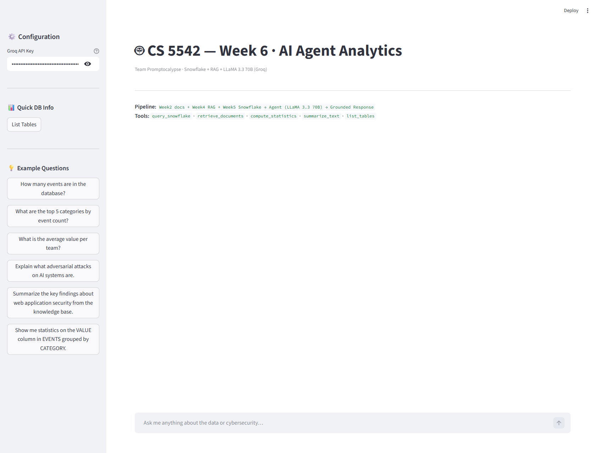
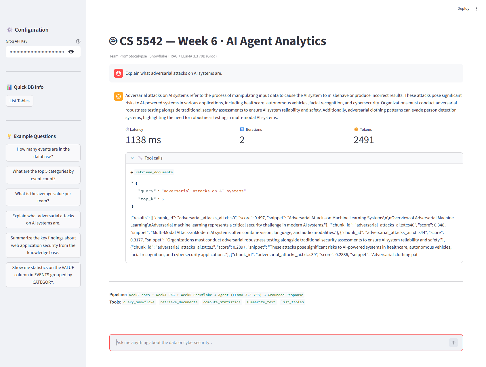
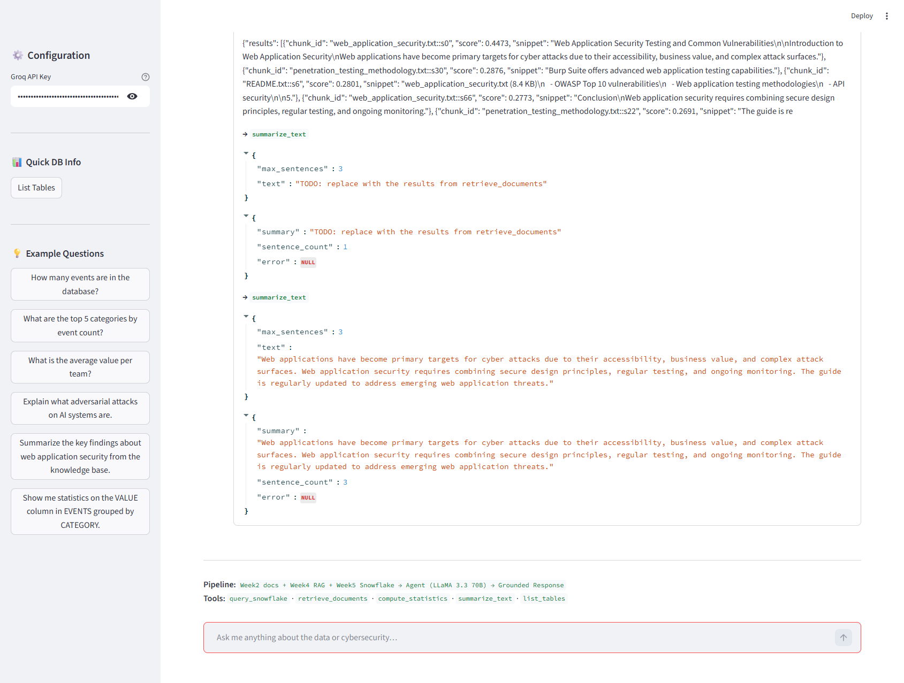
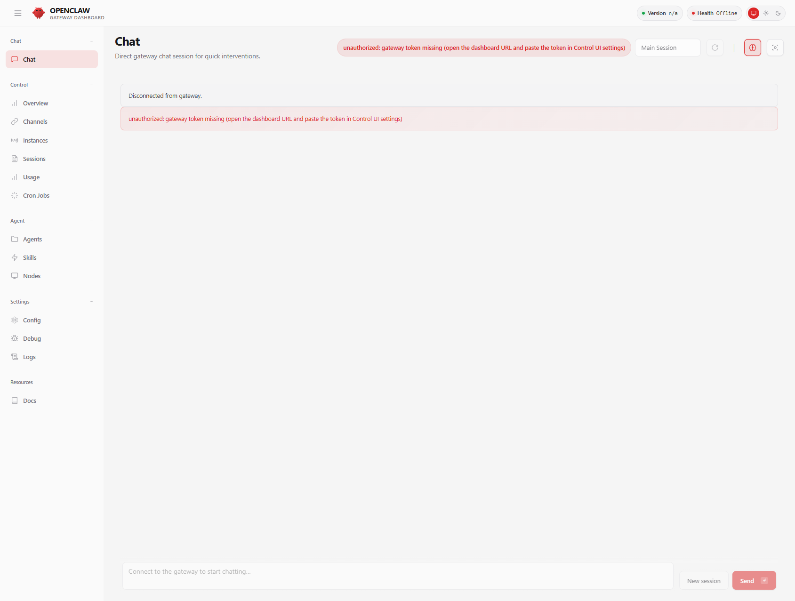

# CS 5542 — Week 6 Lab: AI Agent Integration

**Team Promptocalypse** · Murali Ediga

---

## Overview

This lab extends the Week 5 Snowflake analytics pipeline with an AI agent layer powered
by **LLaMA 3.3 70B** (via Groq) using a ReAct (Reason + Act) architecture. The agent
can reason over user questions, select appropriate tools, and produce grounded answers
from real data.

```
User Query
    ↓
LLaMA 3.3 70B (Groq) — ReAct Loop
    ↓ ↑ tool calls / results
┌──────────────────────────────┐
│  query_snowflake             │ ← CS5542_WEEK5 Snowflake DB
│  retrieve_documents          │ ← Week 2 cybersecurity corpus (TF-IDF)
│  compute_statistics          │ ← Snowflake descriptive analytics
│  summarize_text              │ ← Extractive TF-IDF centroid
│  list_tables                 │ ← Schema discovery
└──────────────────────────────┘
    ↓
Grounded Final Answer → Streamlit Chat UI
```

---

## Files

| File | Description |
|------|-------------|
| `agent.py` | ReAct agent loop — tool dispatch, message construction, iteration guard |
| `tools.py` | 5 callable tool functions with full docstrings and error handling |
| `tool_schemas.py` | OpenAI function-calling schemas for all 5 tools |
| `streamlit_app.py` | Chat UI — history, metrics, tool call logs |
| `task1_antigravity_report.md` | Antigravity IDE analysis and reflection |
| `task4_evaluation_report.md` | 3-scenario evaluation with accuracy/latency/failure analysis |
| `CONTRIBUTION.md` | Individual contribution statement |

---

## Setup

### Prerequisites
- Python 3.10+
- Snowflake account with `CS5542_WEEK5` database (from Week 5)
- Groq API key (free at [console.groq.com](https://console.groq.com))

### Install
```bash
cd CS5542/Week6_Lab
pip install -r requirements.txt
```

### Configure
Copy `.env.example` to `.env` and fill in your credentials:
```
SNOWFLAKE_ACCOUNT=...
SNOWFLAKE_USER=...
SNOWFLAKE_AUTHENTICATOR=PROGRAMMATIC_ACCESS_TOKEN
SNOWFLAKE_TOKEN=...
SNOWFLAKE_WAREHOUSE=COMPUTE_WH
SNOWFLAKE_DATABASE=CS5542_WEEK5
SNOWFLAKE_SCHEMA=PUBLIC
GROQ_API_KEY=...
```

### Run
```bash
streamlit run streamlit_app.py
```

The app opens at `http://localhost:8501`. Enter your Groq API key in the sidebar
(pre-filled from `.env`), then ask questions in the chat interface.

---

## Example Queries

- *"How many events are in the database?"* → single SQL tool call
- *"What are the top 5 categories and what do they mean in cybersecurity?"* → SQL + RAG
- *"Compare average event value by team and explain what adversarial ML risks each faces"* → stats + RAG + summarize

---

## Screenshots

| Screenshot | Description |
|------------|-------------|
|  | Streamlit chat UI — home state with example queries |
|  | Agent answering adversarial ML question via `retrieve_documents` — 1138ms, 2 iterations |
|  | Multi-tool chain: `retrieve_documents` → `summarize_text` for web security summary |
|  | Google Antigravity IDE (OpenClaw) analyzing the project |

## Demo Video

[Link to be added before submission]

---

## Architecture Notes

- **Agent loop:** `MAX_ITERATIONS=6` prevents infinite tool-call cycles
- **Safety:** `query_snowflake` only accepts `SELECT/SHOW/DESCRIBE/WITH` statements
- **RAG corpus:** 12 cybersecurity text files from Week 2 (`Week2_Lab/project_data/`)
- **Model:** `llama-3.3-70b-versatile` via Groq free tier (~14,400 req/day)
